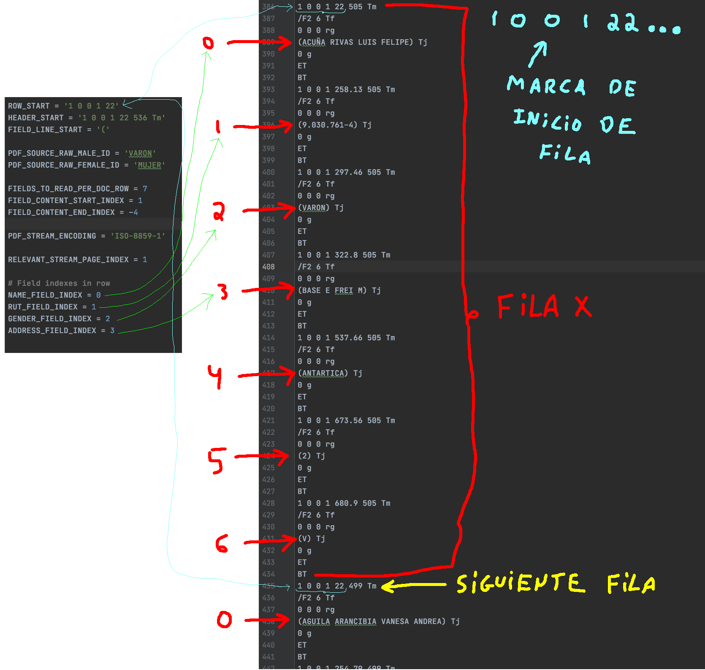

### Permite obtener el padron electoral del Servel

Se ha probado con la data de:
"padron definitivo de elecciones de convencionales constituyentes, gobernadores regionales, alcaldes y concejales 2021"

Última fecha de funcionamiento: 11 de Mayo 2021


#### Corriendo el script

Se requiere python 3.8 o superior

Primero debes clonar el repo y entrar en el

```bash
git clone https://github.com/Eitol/servel_scraper.git

cd servel_scraper
```

Luego seteas las dependencias y el PYTHONPATH

```bash
pip3 install -r ./requirements.txt

export PYTHONPATH=$(pwd)
```

Luego debes correr el pipeline de ejemplo que descargará los pdf's y generará los csv's

```bash
python3 servel_scraper/main.py
```

Los PDF y CSV por defecto se descargan en el directorio "out"

##### Customizando el script

Luego puedes crear tu script customizado basandote en el main.py
Por ejemplo el siguiente asume que ya tienes los ficheros descargados en out/pdf,
por lo que se comenta PipelineStage.DOWNLOAD_PDFS

```python
from servel_scraper.servel_pipeline.servel_pipeline import ServelPipeline, PipelineStage

# Aqui se descargaran los pdfs
DEFAULT_PDF_DOWNLOAD_PATH = "../out/pdf"

# Aquí se guardarán los csv generados
DEFAULT_GENERATED_CSV_PATH = '../out/csv'

p = ServelPipeline(DEFAULT_PDF_DOWNLOAD_PATH, DEFAULT_GENERATED_CSV_PATH)
p.run_pipeline([
    # PipelineStage.DOWNLOAD_PDFS,
    PipelineStage.EXTRACT_CSV_FROM_PDF
])
```

### FAQ:

#### ¿Cuanto pesan todos los pdfs?
Unos 7 gbs aprox

#### ¿Cuantos pdfs son?
Unos 346 (Uno por cada código único territorial)

#### ¿De donde se obtiene esta data?:

Los ficheros del padrón electoral son públicos y están almacenados en una url como la siguiente

"http://cdn.servel.cl/padron/CODIGO_UNICO_TERRITORIAL.pdf"

Donde CODIGO_UNICO_TERRITORIAL se puede obtener del fichero "data/codigo_de_comunas.csv"

Ejemplo:

http://cdn.servel.cl/padron/A01107.pdf

## Actualización Presidenciales 2021:
- La URL cambió a https://cdn.servel.cl/padrondefinitivo:
Ejemplo:
https://cdn.servel.cl/padrondefinitivo/A01107.pdf
- Ya no se incluye el rut de la persona, ni tampoco su sexo.

## Actualización Plebiscito constitucional 2022:
- La URL cambió a https://cdn.servel.cl/padron:
Ejemplo:
https://cdn.servel.cl/padron/A01107.pdf
- Por alguna razón python no valida el certificado ssl de cdn.servel.cl
- Ahora solo está el nombre y la circunscripción

#### ¿Como funciona este script?

1: Descarga cada uno de los pdfs

2: Por cada pdf descargado genera un csv con la data como el siguiente:


Para la versión actual (elecciones presidenciales 2021) genera la siguiente


<br><br>

#### Notas para la extracción de la info

Los nuevos ficheros contienen un texto de fondo que dificulta la extracción del texto utilizando algun OCR o rasterizador pdf.

Entonces se debe recorrer los nodos del documento PDF de la siguiente forma.

Cada página contiene dos streams. 
- El primero contiene el fondo molesto repetido muchas veces (Por ejemplo "Region metropolitana")
- El segundo contiene la data de los votantes. (Este es el que se utiliza)

La estructura se aprecia en la siguiente imagen:


El siguiente paso es extraer la data del stream.

Puedes ver un ejemplo del stream en el fichero doc/data_stream_example.txt


Cada fila inicia con el string "1 0 0 1 22"

La estructura se aprecia en la siguiente imagen:


#### Notas:

Este repositorio tiene fines puramente académicos.

La utilización de este código y de la data recabada es de responsabilidad exclusiva del usuario.
